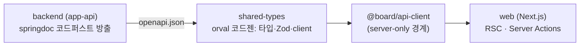

# Polyglot Monorepo Board

폴리글랏 모노레포 가이드를 따라 만든 게시판 데모다. Java/Spring Boot 백엔드와 TypeScript/Next.js 프론트엔드, 언어가 다른 두 앱을 한 저장소에서 같이 빌드하고 OpenAPI 계약 하나로 이어 붙였다.


목록·상세·작성·수정·삭제까지 게시판이 끝까지 돌면, 두 앱이 계약으로 제대로 붙어 있다는 뜻이다.

## 빠른 시작 (Docker Compose)

Docker만 있으면 한 번에 실행된다.

```bash
git clone <this-repo>
cd polyglot-board
docker compose up --build
```

postgres → migration(app-migration이 스키마 생성 후 종료) → backend → seed(예시 글) → frontend 순으로 게이트(완주·healthcheck)를 거쳐 기동한다.

| 서비스 | URL |
| --- | --- |
| 게시판 (Next.js) | http://localhost:3000 |
| REST API (Spring Boot) | http://localhost:8080 |
| Swagger UI | http://localhost:8080/swagger-ui.html |

이것저것 시도하다 처음 상태로 되돌리려면 볼륨까지 지우고 다시 올린다.

```bash
docker compose down -v && docker compose up --build
```

## 아키텍처

루트는 두 언어를 잇는 최소한의 층만 맡는다. 언어별 규칙과 구조는 각 서브 프로젝트가 알아서 갖고, 루트에는 계약·워크스페이스·태스크 그래프만 둔다.

```
polyglot-board/
├── apps/
│   ├── backend/                         Spring Boot — Gradle 멀티모듈 모듈러 모놀리식
│   │   ├── module-apps/app-api          실행 앱
│   │   ├── module-apps/app-migration    Flyway 마이그레이션 전용 앱
│   │   ├── module-domains/domain-board  게시판 도메인
│   │   ├── module-common/               Java 내부 공유
│   │   ├── module-tests/test-architecture ArchUnit 아키텍처 테스트
│   │   └── docs/openapi/openapi.json    방출된 계약
│   └── frontend/                        Next.js — 자체 Turborepo 서브트리(FSD-lite)
│       ├── apps/web                     게시판 웹 앱
│       └── packages/                    TS 내부 공유 (api-client · ui 디자인시스템 · config)
├── packages/
│   └── shared-types/                    계약에서 생성한 타입·Zod·API client
├── docs/
├── docker-compose.yml      
└── turbo.json  pnpm-workspace.yaml  .mise.toml
```

### 계약(OpenAPI) 파이프라인

언어를 가로지르는 "공유 타입"은 두지 않는다. 계약의 원천은 백엔드가 코드에서 뽑아내는 OpenAPI 문서 하나뿐이고, 프론트엔드는 거기서 생성된 산출물만 가져다 쓴다. 흐름은 백엔드에서 프론트로 한 방향이다.



- Turborepo 태스크 그래프가 순서를 강제한다: `backend#openapi → shared-types#codegen → (프론트) build`.
- 생성물은 커밋한다. 계약↔생성물 불일치는 `pnpm verify`의 drift 게이트가 잡는다.
- 에러 계약은 RFC 9457 ProblemDetail을 따르고, 공용 에러 스키마는 `shared-types` 한 곳에만 둔다.

## 기술 스택

| 영역 | 채택 |
| --- | --- |
| 백엔드 | Java 25 · Spring Boot 4.1 · Spring MVC(가상 스레드) · Spring Data JPA · Flyway · Gradle 9.5 멀티모듈 |
| 프론트엔드 | Node.js 24 · Next.js 16 · React 19.2 · TypeScript · Tailwind CSS v4 · FSD-lite |
| 디자인 시스템 | 시맨틱 토큰(색·타이포·모션·레이어) · `@board/ui` 프리미티브 · Storybook 워크벤치 |
| 데이터베이스 | PostgreSQL 17 |
| 계약·코드젠 | OpenAPI(springdoc) · orval · Zod |
| 모노레포 | Turborepo · pnpm workspaces · mise |
| 품질 게이트 | Spotless·NullAway·Error Prone·ArchUnit(백엔드) / ESLint·dependency-cruiser·`server-only` 경계·토큰 우회 차단 린트·Storybook 스토리 게이트(a11y)(프론트) · drift 게이트(루트) |

## 로컬 개발

### 요구사항

툴체인 버전은 [`.mise.toml`](.mise.toml)이 기준이다. [mise](https://mise.jdx.dev)를 쓰면 한 번에 맞춰진다.

```bash
mise install   # JDK(corretto-25) · Node 24 · pnpm 9
```

### 데이터베이스

로컬 5432 충돌을 피해 compose의 postgres는 호스트 5433에 노출된다.

```bash
docker compose up -d postgres
```

### 백엔드

`application.yml` 기본값은 `localhost:5432`이므로, compose postgres(5433)를 쓸 때는 URL을 오버라이드한다.

```bash
cd apps/backend
SPRING_DATASOURCE_URL=jdbc:postgresql://localhost:5433/boardapi \
  ./gradlew :module-apps:app-api:bootRun
```

### 프론트엔드

```bash
pnpm install
pnpm dev       # turbo가 계약 방출 → 코드젠 → next dev 순으로 실행한다
```

개발 모드에서 `BACKEND_API_URL`은 `http://localhost:8080`이 기본값이다. http://localhost:3000 에서 확인한다.

### 검증

```bash
pnpm verify
```

한 명령으로 전체 게이트가 돈다.

- `turbo run verify` — 백엔드 `./gradlew build`(테스트·아키텍처 테스트·정적분석 포함, Testcontainers로 PostgreSQL 필요), 프론트 lint·typecheck·format 체크, `@board/ui` 워크벤치 스토리 게이트(Storybook 빌드·a11y)
- `depcruise` — 프론트 패키지 의존 방향 검사
- `drift:check` — 계약에서 재생성한 결과와 커밋된 생성물의 일치 검사

## 문서

아키텍처와 공유 규칙은 아래 문서에 정리돼 있다. 진입점은 [`AGENTS.md`](AGENTS.md)다.

- [`docs/architecture.md`](docs/architecture.md) — 저장소 구조 · 공유 패키지 배치 · 소유/위임 경계 · 경계 강제
- [`docs/sharing.md`](docs/sharing.md) — 계약 seam · 코드젠 파이프라인 · drift 게이트 · 에러 모델
- [`apps/backend/README.md`](apps/backend/README.md) — 백엔드(Spring Boot) — REST API·모듈 구조·실행·검증
- [`apps/frontend/README.md`](apps/frontend/README.md) — 프론트엔드(Next.js) — 화면·구조·데이터 흐름·검증
